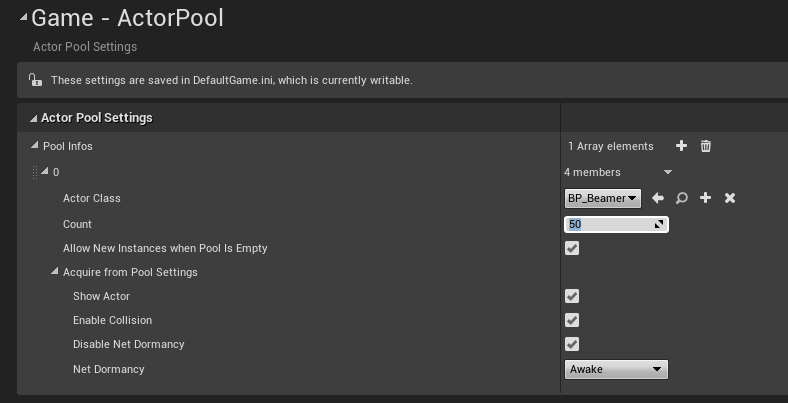
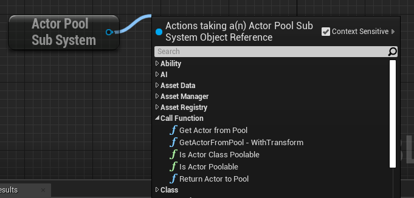

This plug-in provides a way to create pools of actors, to avoid spawning and destroying them during gameplay.

# Configuration

First put the plugin in the Plugins folder of your project and enable it in your uproject.

Then when you launch the editor, a new `ActorPool` section will be available in the `Game` category of the `Project Settings`.



To create a pool of an actor class, you must add a new entry to the `Pool Infos` array, then select the actor class, and the number of instances you want to create automatically when the game starts.

`Allow new instances when pool is empty` will make the system create new instances when you require more actors than the number of pre-spawned actors.

`Acquire from Pool Settings` are the options to configure an actor when it is acquired from the pool. By default, it will be made visible, will have its collision enabled, and will move out of net dormancy.

# Pooled Actor Interface

The plugin works for any actor class, and has some actions it does automatically by default on all actors, based on the pool infos.

But it's possible to extend those actions per actor class.

To do that, you need to make your actor class implement the interface `IAPPooledActorInterface`.

This interface declares 2 blueprint native event functions:

```
UFUNCTION( BlueprintNativeEvent, BlueprintCallable )
void OnAcquiredFromPool();

UFUNCTION( BlueprintNativeEvent, BlueprintCallable )
void OnReturnedToPool();
```

You can then implement those events in C++ or in blueprint to add additional cleanup / wake-up code when the instance goes back to the pool, or is acquired from it.

# Usage



When you need an instance of an actor from the pool, you need to call `Get Actor From Pool` on the `Actor Pool Subsystem`. You can use `Get Actor From Pool - WithTransform` if you want to teleport the actor to a given world transform.

When you are done with the actor, you just need to call `Return Actor to Pool`.

# Console commands

`ActorPool.DestroyUnusedInstancesInPools` : will destroy all instances which have not been acquired by the game.

This is helpful for example to debug a specific actor and don't want to search for the correct actor in the whole list of instanced waiting in the pool.

# Console variables

`ActorPool.ForceInstanceCreationWhenPoolIsEmpty [0|1]` : Will force a new instance to be created when you want to acquire a new actor on an empty pool, even if in the pool infos you set `Allow new instances when pool is empty` to false.